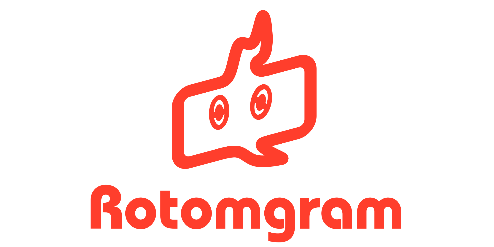

## What is Rotomgram?
Rotomgram is a Telegram Bot that provides all informations about Pokémon. It's accessible through this link https://t.me/RotomgramBot or writing @RotomgramBot on Telegram search bar

## How it works?
The bot has 3 main commands:

### /data
/data is the main command of the bot acts as Pokedex on Telegram. Writing "/data PokemonName", it returns:
* Main data (Name, Dex number, Type, Ability)
* Other informations about it (such as EV yield, catch rate, egg groups, etc) accessible through "Expand" inline button
* Base stats
* Official artwork
* Moveset
* Location
* Minimum/Maximum statistics at level 100e
* Evolutionary methods
* Alternative forms informations
* Infos about its alternative forms

### /newraid
This command provides a tool for manage Pokemon Sword & Shield Raid Dynamax. Using "/newraid PokemonName", you can search for players in a group. When the Raid it's ready, clicking on "Close" it generate a random password visible at only the participants of the Raid.

### /usage
Finally, this command is very easy. It simply returns VGC usage

## Credits
APIs have not been used to build this bot. So, some thanks are due:
* PokémonDB (pokemondb.net) for their data
* Smogon (smogon.com) for VGC usage

## Support
If you need me, you can contact me sending me an e-mail at alessiocelentano2003@gmail.com or sending a message on Telegram at https://t.me/alessiocelentano (@alessiocelentano on the app)
