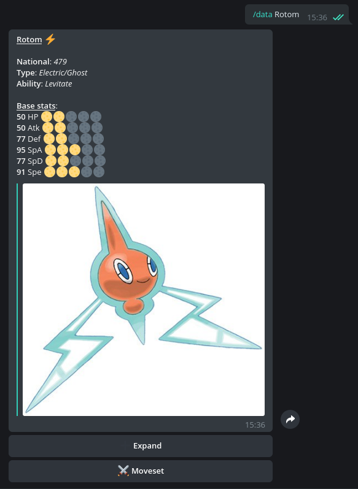

# Rotomgram
Rotomgram is a Telegram Bot written in Python (pyTelegramBotAPI) that provides all informations about Pokémon. It's accessible through this link https://t.me/RotomgramBot or writing @RotomgramBot on Telegram search bar

## How it works?
The bot has one main command: /data. Using /data <PokémonName> Rotomgram sends in the chat these informations:
* Main data (Name, Dex number, Type, Ability)
* Base stats and rating using emoticons
* Official artwork
* Other informations about it (such as EV yield, catch rate, egg groups, etc) accessible through "Expand" inline button
* Moveset
* Location
* Minimum/Maximum statistics at level 100e
* Evolutionary methods
* Alternative forms informations

The other important command is /usage, that return Pokémon Showdown VGC leaderboard usage

Other commands (such as /ability <ability>, /move <move>, etc) send information about that specific thing and the Pokémon that can have/learn it (Work in progress)

## Credits
APIs have not been used to build this bot. So, some thanks are due:
* PokémonDB (pokemondb.net) for their data
* Smogon (smogon.com) for VGC usage

## Support
If you need me, you can contact me sending me an e-mail at alessiocelentano2003@gmail.com or sending a message on Telegram at https://t.me/alessiocelentano (@alessiocelentano on the app)
